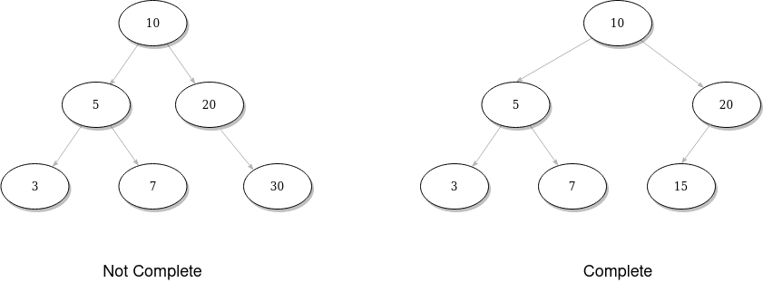

# Trees
Notes on trees

## Types of trees
- Tree: an Nary tree (1,2,3...) child nodes.
- Binary Tree: Tree with specifically 2 child nodes.
- Binary Searh Tree: Binary Tree where child nodes follow an specific order.
- Balanced Tree: Not terribly imbalanced tree.
- Complete Binary Tree: Trees where every level but leaves are completely filled (left to right).
    
- Full Binary Tree: Every node has either two or zero nodes.
- Quad Tree: Just like binary tree but with 4 nodes, used specially for geolocation implementations.

## Binary Tree traversal
- In-Order: `left` -> `current` -> `right`
- Pre-Order: `current` -> `left` -> `right`
- Post-Order: `left` -> `right` -> `current`

## Binary Heaps (Or Min and Max heaps)
A Binary Heap or also known as Heap is a complete binary tree where every node is *smaller* than it's childs (Min Heap), the opposite of this would be a Max Heap where every node is *bigger* than it's childs.
It has 2 operations insert element and extract top element.
- Insert: will insert element at bottom of heap and will heapify it up until it reaches a position where the heap remains sorted.
- Extract: will get and remove the top element, then heapifying up corresponding child to take the place at the top.